 

### PI

#### **Changjun LEE \| 이창준**

 

::::: grid
::: g-col-4
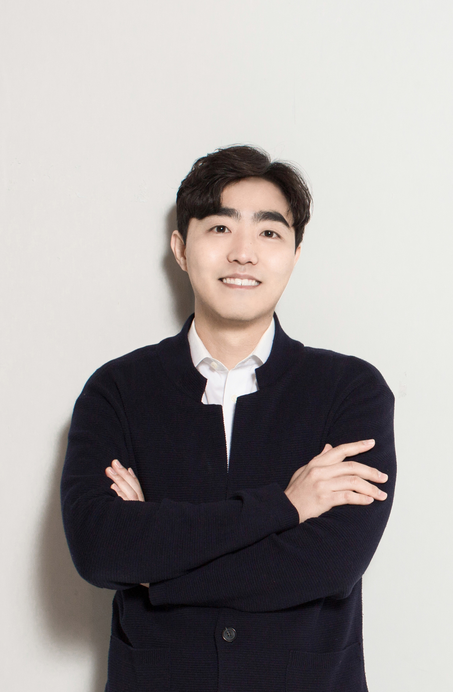{width="130"}

([changjunlee.com](https://www.changjunlee.com))
:::

::: g-col-8
**Sungkyunkwan University (SKKU)**

-   School of Convergence\
    Dep. of Culture & Technology

-   Graduate School

    -   Dep. of Interaction Science

    -   Dep. of Immersive Media Engineering\
        (Metaverse Graduate School)
:::
:::::

> As a computational social scientist, CJ brings a unique interdisciplinary perspective to the fields of economics, innovation studies, and convergence technologies. CJ's research focuses on utilizing computational methods to tackle a wide range of social phenomena, including technology evolution & regional growth, knowledge management, and technology & convergence innovation.

 

### Ph.D. Students

 

-   Seo Young PARK \| **박서영**

    ::::: grid
    ::: g-col-4
    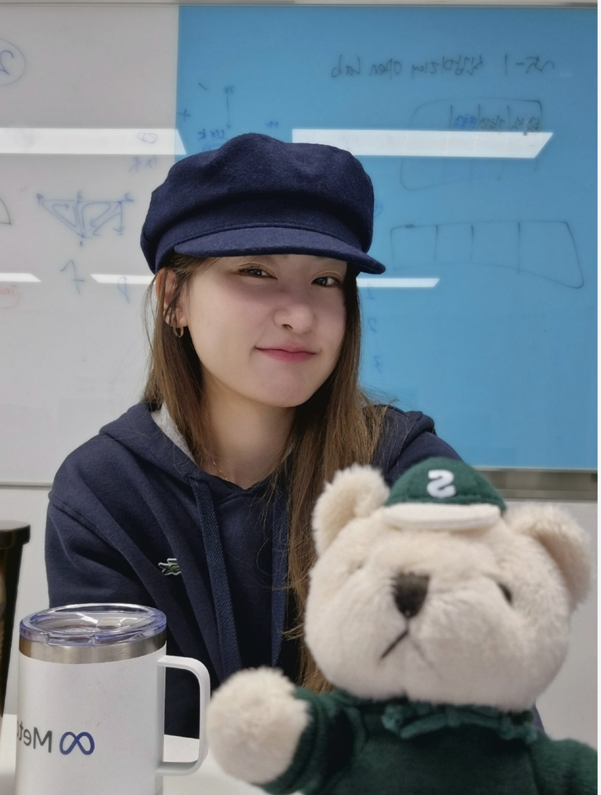{width="130"}
    :::

    ::: g-col-8
    Sungkyunkwan Universiy

    Department of Immersive Media Engineering

    ✉ vespera.kr\@gmail.com
    :::
    :::::

> SeoYoung is majored in sculpture and She is interest in immersive media and technology. She is passionate about creating new artistic experiences through audience interaction.

 

-   Ye Seo LIM \| **임예서 \| *Lab Modulaotor**

    ::::: grid
    ::: g-col-4
    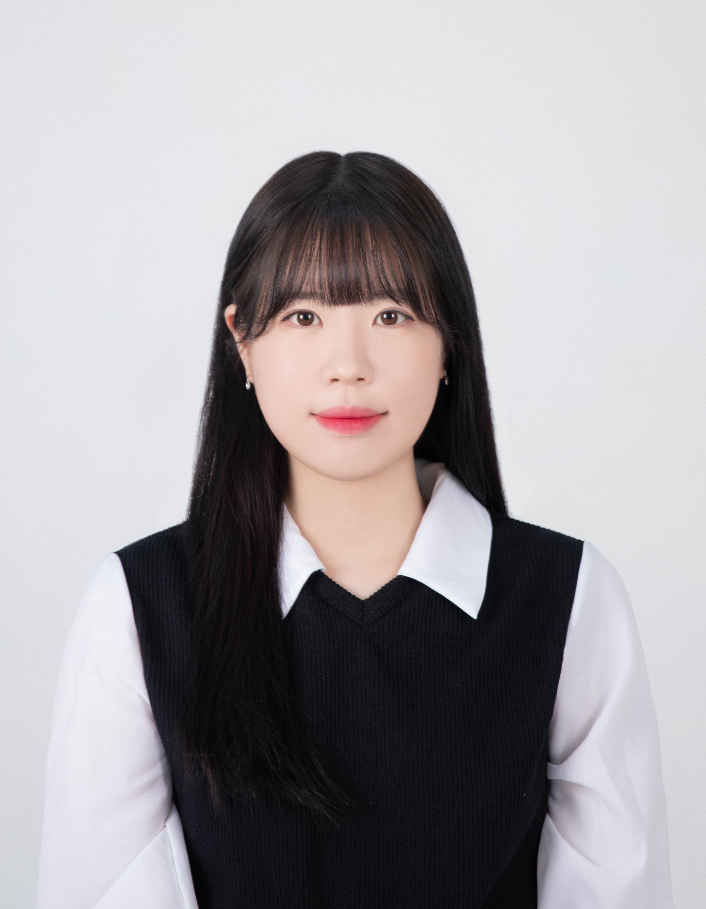{width="130"}
    :::

    ::: g-col-8
    Sungkyunkwan University

    Department of Applied Artificial Intelligence

    ✉ ivisy6952\@g.skku.edu
    :::
    :::::

    > YS majored in media and social informatics and double majored in computer science. She is interested in the convergence of social science, such as media contents, and engineering science, such as computing and AI.

 

### Master's degree Students

 

-   Sooyun KIM \| **김수연**

    ::::: grid
    ::: g-col-4
    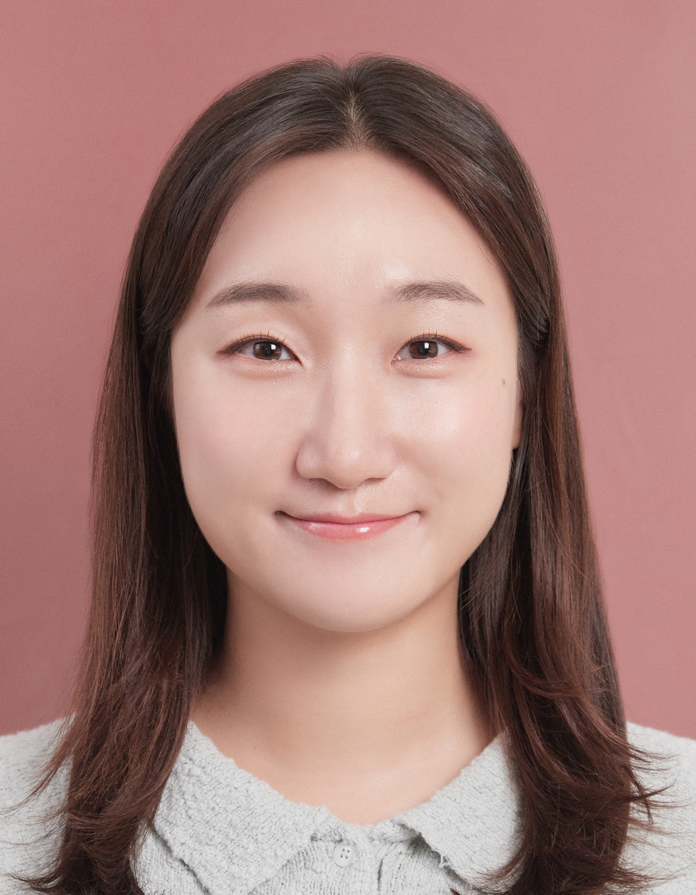{width="130"}
    :::

    ::: g-col-8
    Sungkyunkwan University

    Department of Interaction Science

    ✉ soo1234\@g.skku.edu
    :::
    :::::

    > Sooyun majored in Chemistry and minored in Psychology. She is interested in user experience (UX) and human-computer interaction (HCI), with a focus on AI, digital platforms, and immersive media.

 

-   Gahui KIM \| **김가희**

    ::::: grid
    ::: g-col-4
    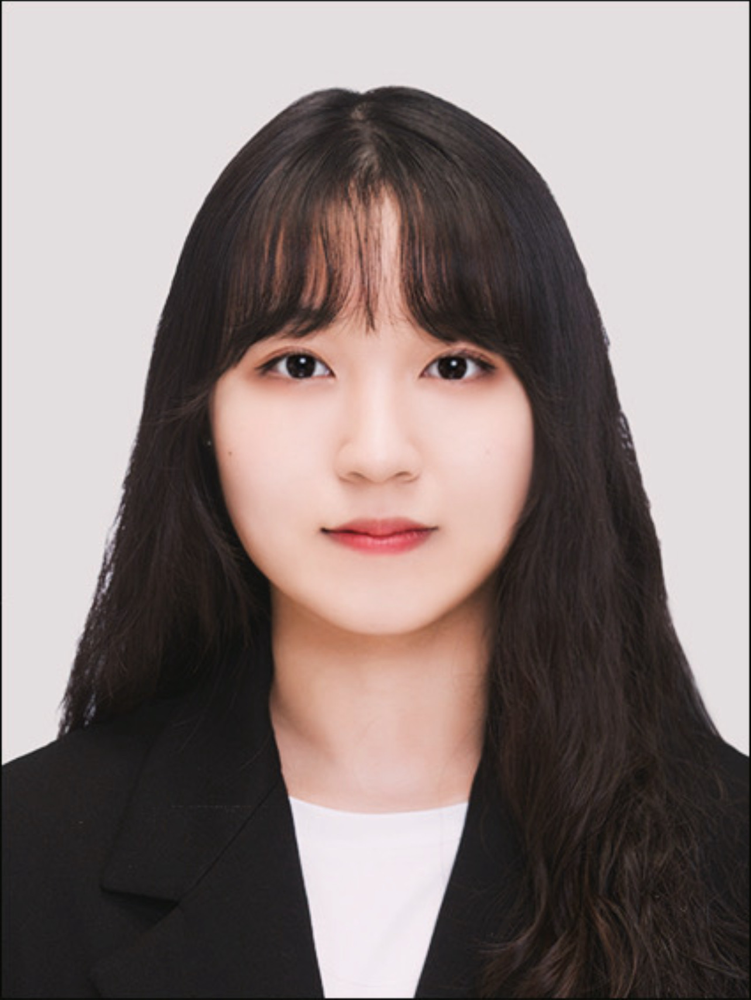{width="130"}
    :::

    ::: g-col-8
    Sungkyunkwan University

    Department of Immersive Media Engineering

    ✉ gahee020907\@g.skku.edu
    :::
    :::::

    > Gahui majored in Culture&Technology Convergence and International Trade. She is interested in cultural content and immersive media, focusing on the relationship between user experience and content.

 

-   Yebom CHOI \| **최예봄**

    ::::: grid
    ::: g-col-4
    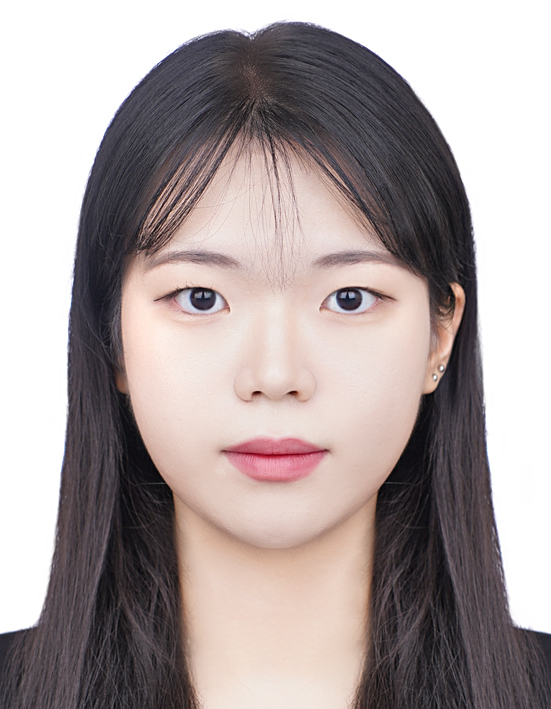{width="130"}
    :::

    ::: g-col-8
    Sungkyunkwan University

    Department of Interaction Science

    ✉ yebom618\@g.skku.edu
    :::
    :::::

    > Yebom majored in Culture&Technology Convergence and double majored in Psychology. She is interested in the high technology industry based on understanding of humans.

 

-   Eunhye SHIM \| **심은혜**

    ::::: grid
    ::: g-col-4
    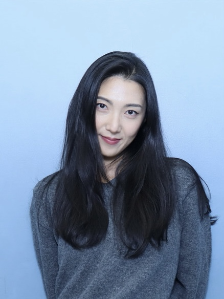{width="130"}
    :::

    ::: g-col-8
    Sungkyunkwan University

    Department of Interaction Science

    ✉ eunhyeshim807\@naver.com
    :::
    :::::

    > Eunhye Shim majored in Photography and Video and worked as a policy researcher in the field of public cultural and art policy in Korea. Her research focuses on user experience and digital media, with an emerging interest in how people perceive and respond to technological changes in digital media environments.

 

-   Yoojeong KIM \| **김유정**

    ::::: grid
    ::: g-col-4
    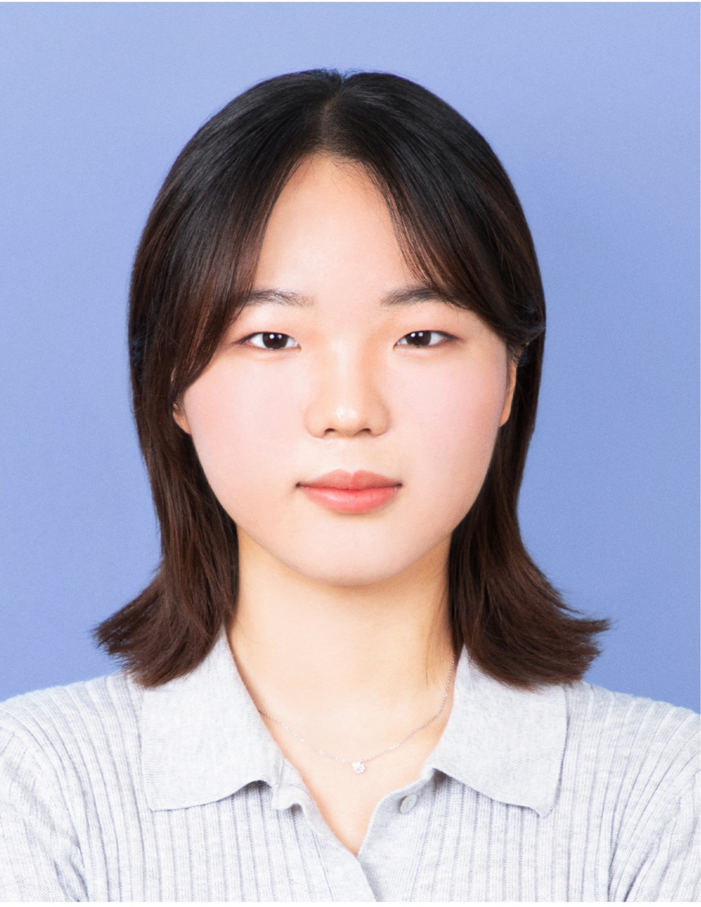{width="130"}
    :::

    ::: g-col-8
    Sungkyunkwan University

    School of Convergence (*Dep. of Culture & Technology*)

    Department of Interaction Science

    ✉ yoojung0425\@g.skku.edu
    :::
    :::::

    > Yoojeong majored in Culture&Technology Convergence. She is interested in transmedia content with new social, cultural value based on artificial intelligence and immersive technology.

 

-   KangU LEE \| **이강우**

    ::::: grid
    ::: g-col-4
    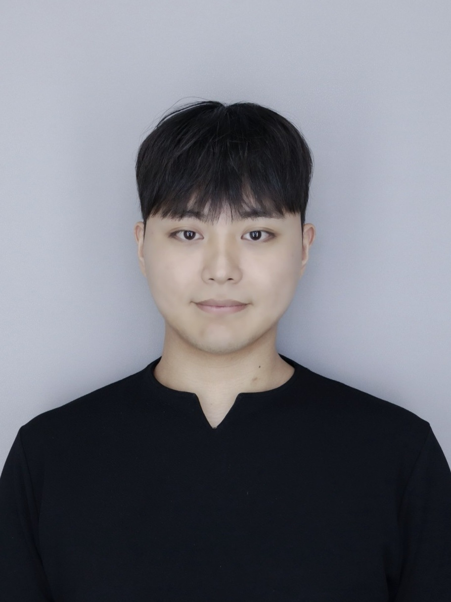{width="130"}
    :::

    ::: g-col-8
    Sungkyunkwan University

    Department of Applied Artificial Intelligence

    ✉ goguri0408@g.skku.edu
    :::
    :::::

    > KangU double-majored in Media and Social Informatics and ICT Convergence. KangU's interests lie in combining social science fields—such as media and local communities—with data science and AI to solve real-world problems.

 

-   Haemin Hong \| **홍혜민**

    :::: grid
    
    ::: g-col-4
    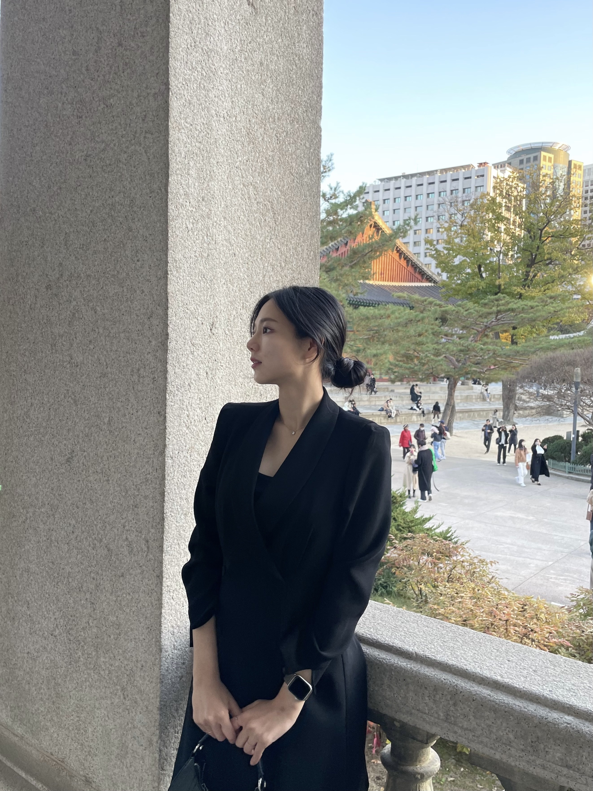{width="130"}
    :::
    
    
    ::: g-col-8
    Sungkyunkwan University

    Department of Interaction Science

    ✉ haemcheeese@skku.edu
    :::
    ::::

    > She double majored in Media and Social Informatics and Advertising and PR. Her interests lie in exploring how technology can be used in ways that benefit people and how it can contribute to solving social challenges.

 

-   Jeemin Oh \| **오지민**

    ::::: grid
    ::: g-col-4
    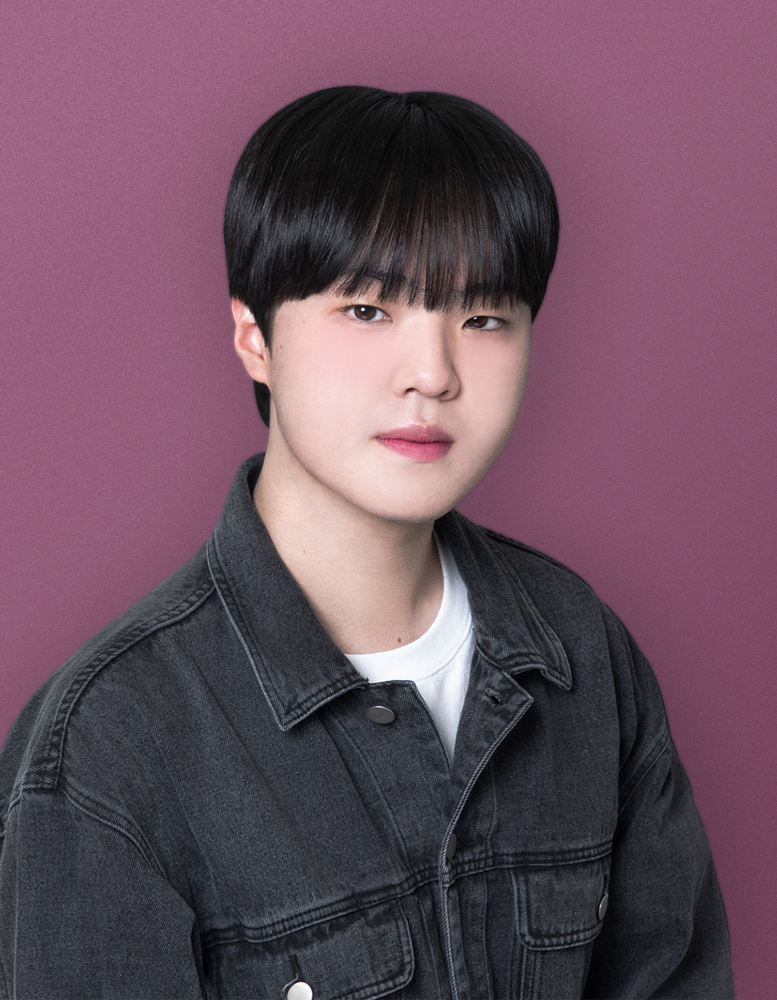{width="130"}
    :::

    ::: g-col-8
    Sungkyunkwan University

    Department of Interaction Science

    ✉ faintpink95\@naver.com
    :::
    :::::

    > He majored in Media & Communication and AI•SW Convergence. He is interested in computational social science in the field of human-computer interaction (HCI), with a focus on big data.

### Undergraduate Researcher

 

-   Ga Hyeon KIM \| **김가현**

    ::::: grid
    ::: g-col-4
    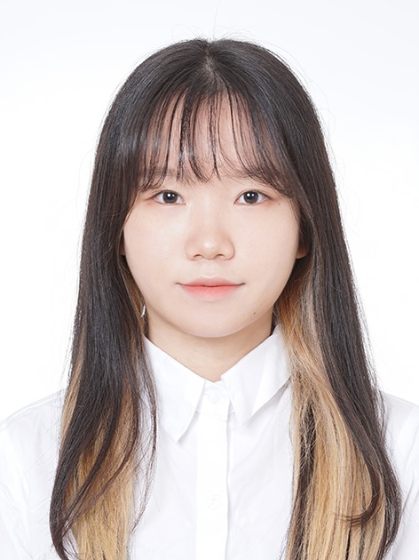{width="130"}
    :::

    ::: g-col-8
    Sungkyunkwan University

    School of Convergence (*Dep. of Culture & Technology*)

    ✉ mulik425\@g.skku.edu
    :::
    :::::

    > Ga Hyeon majored in Culture &Technology Convergence and double majored in Department of Computer Science and Engineering. She is interested in Entertainment and Content Business based on AI & Immersive Technology.

 

### Part time Researcher (MS)

 

-   Sungwoo Choung \| **정성우** \| LG Energy Solution

    ::::: grid
    ::: g-col-4
    {width="130"}
    :::

    ::: g-col-8
    Sungkyunkwan University

    Department of Data Science

    ✉ ymrensol\@lgensol.com
    :::
    :::::

    > Sungwoo Choung graduated from Yonsei University with a degree in Nano Science(Bachelor of Nanoscience Engineering) and Chemical Engineering(Bachelor of Chemical and Biomolecular Engineering). Now, he is in charge of Natural Language Processing (NLP) and Assessment of Large Language Models (LLM) at LG Energy Solution and studying Data Science at Sungkyunkwan University. He is interested in the application of Data Science and NLP.

 

## Alumni

 

-   Yunwoo CHOI \| **최윤우**

    -   2023-2024 연구교수

    -   現 조선대 미디어커뮤니케이션 전임교수

-   Jieun PARK \| **박지은**

    -   2022 석사졸업 \| 現 KISDI 연구원 (2024-2025 KAKAO 정책팀)

-   Seonwoo LEE \| **이선우**

    -   2024 학부연구생 졸업 \| 現 Cornell University 석사과정
